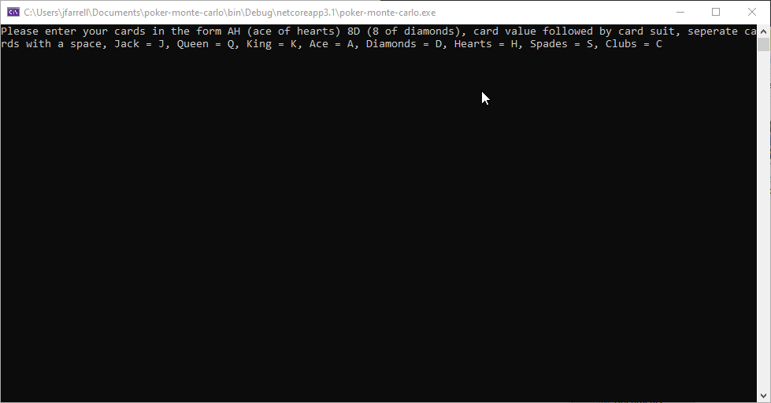

# Poker-Monte-Carlo
A monte carlo simulator to predict a players chance of winning a poker hand.

Reactive frontend version coming soon to https://www.johnfarrell.dev/

# Instructions

git clone `https://github.com/JohnFarrellDev/Poker-Monte-Carlo`

The Main function exists inside MonteCarlo.cs

Project can be compiled into an exe from C# or run directly within Visual Studio.
